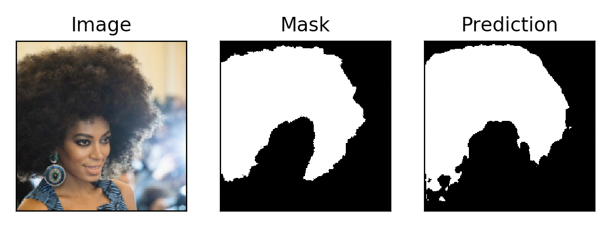

# hair-dye



## Create environment

```
$ conda env create -f environment.yml
$ source activate hairdye
```

Deactivate the environment by

```
source activate hairdye
```

## Download dataset

```
$ sh download.sh
```

## Train

```
$ nohup python -u main.py --mode=train > out.log &
```

The checkpoint and sample images are saved in `src/checkpoint/default/` by default.

## Test
```
$ python main.py --mode=test
```

## Run

Plot a groundtruth image, the predicted segmentation and the hue adjusted result from the datasets or any specified image

```
$ python main.py --mode=run --set=test --num=4
$ python main.py --mode=run --image=./path/to/the/image.png
```

`set` can be one `train` and `test`, default is `test`

`num` is the random number of images from the set, default is `4`
