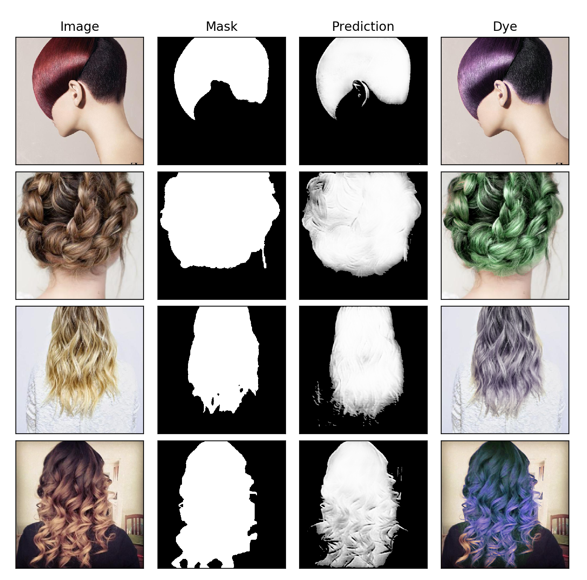

# hair-dye



## Create environment

```
$ conda env create -f environment.yml
$ source activate hairdye
```

After you have done all the training and testing things, in the end, you can deactivate the environment by running `source deactivate`.
And the next time you want to train your network, just run `source activate hairdye`, you only have to create the environment once.

## Download dataset

```
$ sh download.sh
```

## Train

```
$ cd src
$ nohup python -u main.py --mode=train > out.log &
```

The checkpoint file and sample images can be seen in `src/checkpoint/default/` directory.

## Test
```
$ python main.py --mode=test
```

## Run

Plot a groundtruth image, the predicted segmentation and the hue adjusted result

```
$ python main.py --mode=run --set=test --num=4
```

`set` can be one `train` and `test`, default is `test`

`num` is the random number of images from the set, default is `4`
